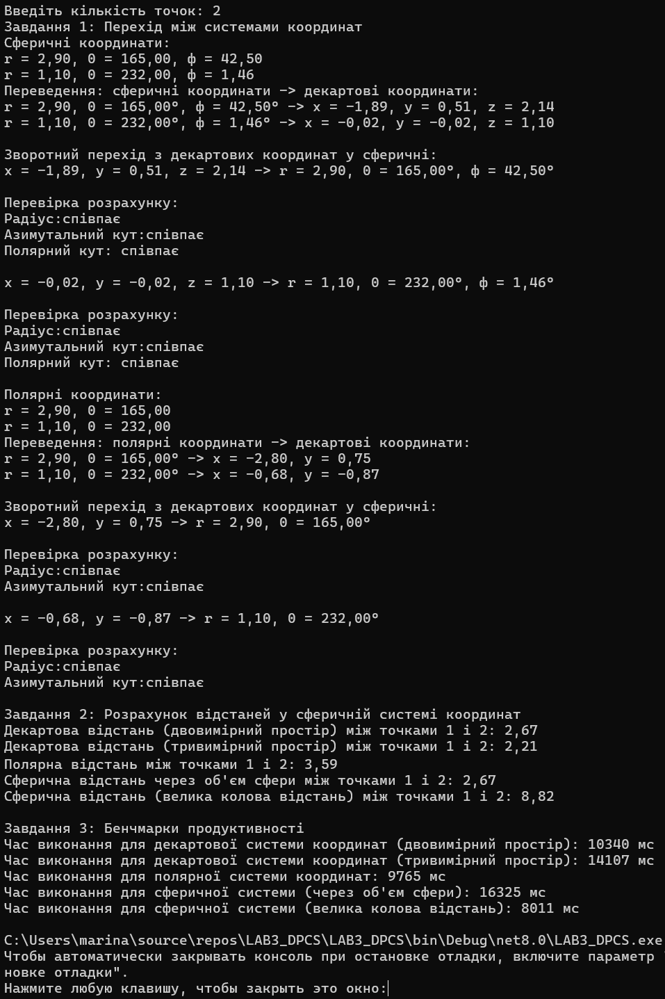

<h1> <b> Лабораторна робота №3. Реалізація перетворень між системами координат. </b> </h1>

<b>Мета:</b> Ознайомитися з різними системами координат (декартовою, полярною та сферичною) та отримати практичні навички у переході між ними. Визначити обчислювальну ефективність розрахунку відстаней у цих системах координат через бенчмаркінг.

<b>Завдання:
<ol>
  <li>Перехід між системами координат:
    <ul>
      <li>Двовимірний простір: Декартова та полярна системи координат:
        <ul>
          <li>Задати координати декількох точок у полярній системі координат.</li>
          <li>Перевести ці координати в декартову систему координат.</li>
          <li>Здійснити зворотний перехід з декартової системи координат в полярну.</li>
          <li>Перевірити коректність розрахунків, упевнившись, що вихідні координати співпадають з отриманими після зворотного перетворення.</li>
        </ul>
      </li>
      <li>Тривимірний простір: Декартова та сферична системи координат:
        <ul>
          <li>Задати координати декількох точок у сферичній системі координат.</li>
          <li>Перевести ці координати в декартову систему координат.</li>
          <li>Здійснити зворотний перехід з декартової системи координат в сферичну.</li>
          <li>Перевірити коректність розрахунків, упевнившись, що вихідні координати співпадають з отриманими після зворотного перетворення.</li>
        </ul>
      </li>
    </ul>
  </li>
  <li>Розрахунок відстаней у сферичній системі координат:
    <ul>
      <li>Виконати обчислення відстані між точками у сферичній системі координат двома способами:</li>
      <ol>
        <li><b>Декартова система координат:</b>
          <ul>
            <li>Використати стандартну формулу для обчислення прямої відстані у двовимірному та тривимірному просторі.</li>
          </ul>
        </li>
        <li>Полярна система координат:
          <ul>
            <li>Використати формулу для обчислення відстані між точками у двовимірному просторі.</li>
          </ul>
        </li>
        <li>Сферична система координат:
          <ul>
            <li>Через об'єм сфери: використати формулу для прямої відстані у тривимірному просторі.</li>
            <li>По поверхні сфери: використати формулу для великої колової відстані.</li>
          </ul>
        </li>
      </ol>
    </ul>
  </li>
  <li>Бенчмарки продуктивності:
    <ul>
      <li>Згенерувати масив координат пар точок у кожній системі координат (декартова, полярна, сферична).</li>
      <li>Виконати розрахунок відстаней між цими точками для кожної системи координат.</li>
      <li>Виміряти тривалість обчислень для кожної системи координат.</li>
      <li>Обрати такий розмір масиву, за якого результат бенчмаркінгу матиме незначну варіативність від запуску до запуску (рекомендовано розмір масиву 10,000 - 100,000 точок).</li>
    </ul>
  </li>
</ol> </b>
<p>Декартова система координат у двовимірному просторі визначає точку за координатами 𝑥 та 𝑦.</p>
<p>Полярна система координат визначає точку за радіусом 𝑟 та кутом 𝜃, де r — радіус-відстань від початку координат до точки, а 𝜃 — кут (азимут) між позитивною віссю X та прямою, що проходить через точку.</p>
<p>Для перетворення з полярної в декартову систему застосовуються такі формули:</p>
<p align="center">x = r ⋅ cos(θ)</p>
<p align="center">y = r ⋅ sin(θ)</p>
<p>З декартової в полярну систему:</p>
<p align="center">r = √(x² + y²)</p>
<p align="center">θ = arctan(y/x)</p>
<p>Сферична система координат визначає точку за радіусом 𝑟 та кутами 𝜃 та ϕ, де r — радіус-відстань від початку координат до точки, 𝜃 — азимутальний кут (аналог довготи), ϕ — полярний кут (аналог широти).</p>
<p>Для перетворення з сферичної в декартову систему застосовуються такі формули:</p>
<p align="center">x = r ⋅ sin(ϕ) ⋅ cos(θ)</p>
<p align="center">y = r ⋅ sin(ϕ) ⋅ sin(θ)</p>
<p align="center">z = r ⋅ cos(ϕ)</p>
<p>З декартової в сферичну систему:</p>
<p align="center">r = √(x² + y² + z²)</p>
<p align="center">θ = arctan(y/x)</p>
<p align="center">ϕ = arccos(z/r)</p>
<p>Для розрахунку прямої відстані між двома точками у декартовій системі координат застосовуються такі формули:</p>
<p>Для двовимірного простору:</p>
<p align="center">d = √((x₂ - x₁)² + (y₂ - y₁)²)</p>
<p>Для тривимірного простору:</p>
<p align="center">d = √((x₂ - x₁)² + (y₂ - y₁)² + (z₂ - z₁)²)</p>
<p>Формула для обчислення прямої відстані між двома точками у полярній системі координат:</p>
<p align="center">d = √(r₁² + r₂² - 2r₁r₂cos(θ₂ - θ₁))</p>
<p>Для обчислення прямої відстані між двома точками у сферичній системі координат (через об'єм сфери) застосовується формула:</p>
<p align="center">d = √(r₁² + r₂² - 2r₁r₂(sinθ₁sinθ₂cos(ϕ₁ - ϕ₂) + cosθ₁cosθ₂))</p>
<p>Дугову відстань між двома точками на поверхні сфери (велика колова відстань) можна знайти за допомогою формули:</p>
<p align="center">d = r⋅arccos(sin(ϕ₁)sin(ϕ₂) + cos(ϕ₁)cos(ϕ₂)cos(θ₁ - θ₂))</p>

<p>Створюємо програму переходу між системами координат, обчислення відстаней в різних системах координат та тривалість обчислень для кожної системи координат (розмір масиву 10000 точок):</p>

``` csharp
using System;
using System.Diagnostics;

class Program
{
    // Перетворення градусів у радіани
    static double ConvertDegreesToRadians(double degrees)
    {
        return degrees * Math.PI / 180.0;
    }

    // Перетворення радіан у градуси
    static double ConvertRadiansToDegrees(double radians)
    {
        return radians * 180.0 / Math.PI;
    }

    // Перетворення полярних координат в декартову систему координат
    static (double, double) TransformPolarIntoCartesian(double radius, double theta)
    {
        double x = radius * Math.Cos(ConvertDegreesToRadians(theta));
        double y = radius * Math.Sin(ConvertDegreesToRadians(theta));
        return (x, y);
    }

    // Перетворення з декартової системи координат у полярну
    static (double, double) TransformCartesianIntoPolar(double x, double y)
    {
        double radius = Math.Sqrt(x * x + y * y);
        double theta = ConvertRadiansToDegrees(Math.Atan2(y, x));

        if (theta < 0)
        {
            theta += 360;
        }

        return (radius, theta);
    }

    // Перетворення сферичних координат в декартову систему координат
    static (double, double, double) TransformSphericalIntoCartesian(double radius, double theta, double phi)
    {
        double x = radius * Math.Sin(ConvertDegreesToRadians(phi)) * Math.Cos(ConvertDegreesToRadians(theta));
        double y = radius * Math.Sin(ConvertDegreesToRadians(phi)) * Math.Sin(ConvertDegreesToRadians(theta));
        double z = radius * Math.Cos(ConvertDegreesToRadians(phi));
        return (x, y, z);
    }

    // Перетворення з декартової системи координат у сферичну
    static (double, double, double) TransformCartesianIntoSpherical(double x, double y, double z)
    {
        double radius = Math.Sqrt(x * x + y * y + z * z);
        double theta = ConvertRadiansToDegrees(Math.Atan2(y, x));
        double phi = ConvertRadiansToDegrees(Math.Acos(z / radius));

        if (theta < 0)
        {
            theta += 360;
        }

        return (radius, theta, phi);
    }

    // Пряма відстань між двома точками у декартовій системі координат (двовимірний простір)
    static double DistanceCartesian2D(double x1, double y1, double x2, double y2)
    {
        return Math.Sqrt(Math.Pow(x2 - x1, 2) + Math.Pow(y2 - y1, 2));
    }

    // Пряма відстань між двома точками у декартовій системі координат (тривимірний простір)
    static double DistanceCartesian3D(double x1, double y1, double z1, double x2, double y2, double z2)
    {
        return Math.Sqrt(Math.Pow(x2 - x1, 2) + Math.Pow(y2 - y1, 2) + Math.Pow(z2 - z1, 2));
    }

    // Пряма відстань між двома точками у полярній системі координат
    static double DistancePolar(double radius1, double theta1, double radius2, double theta2)
    {
        return Math.Sqrt(Math.Pow(radius1, 2) + Math.Pow(radius2, 2) - 2 * radius1 * radius2 * Math.Cos(theta2 - theta1));
    }

    // Пряма відстань між двома точками у сферичній системі координат (через об'єм сфери)
    static double DistanceSphericalVolume(double radius1, double theta1, double phi1, double radius2, double theta2, double phi2)
    {
        return Math.Sqrt(Math.Pow(radius1, 2) + Math.Pow(radius2, 2) - 2 * radius1 * radius2 * (Math.Sin(theta1) * Math.Sin(theta2) * Math.Cos(phi1 - phi2) + Math.Cos(theta1) * Math.Cos(theta2)));
    }

    // Дугова відстань між двома точками на поверхні сфери (велика колова відстань)
    static double DistanceSphericalGreatCircle(double radius1, double theta1, double phi1, double theta2, double phi2)
    {
        return radius1 * Math.Acos(Math.Sin(phi1) * Math.Sin(phi2) + Math.Cos(phi1) * Math.Cos(phi2) * Math.Cos(theta1 - theta2));
    }

    static void Main()
    {
        Random rand = new Random();

        Console.Write("Введіть кiлькiсть точок: ");
        int numOfPoints = int.Parse(Console.ReadLine());


        Console.Write("Завдання 1: Перехiд мiж системами координат\n");
        // Генеруємо випадкові сферичні координати
        var sphericalCoordinates = new (double radius, double theta, double phi)[numOfPoints];
        for (int i = 0; i < numOfPoints; i++)
        {
            double radius = rand.NextDouble() * 10; // Випадковий радіус від 0 до 10
            double theta = rand.Next(0, 360); // Випадковий азимутальний кут від 0 до 360 градусів
            double phi = rand.NextDouble() * 180; // Випадковий полярний кут від 0 до 180 градусів
            sphericalCoordinates[i] = (radius, theta, phi);
        }

        Console.WriteLine("Сферичнi координати:");
        for (int i = 0; i < sphericalCoordinates.Length; i++)
        {
            Console.WriteLine($"r = {sphericalCoordinates[i].radius:F2}, 0 = {sphericalCoordinates[i].theta:F2}, ф = {sphericalCoordinates[i].phi:F2}");
        }

        // Перетворюємо сферичні координати в декартові
        var cartesian3DCoordinates = new (double x, double y, double z)[sphericalCoordinates.Length];
        for (int i = 0; i < sphericalCoordinates.Length; i++)
        {
            cartesian3DCoordinates[i] = TransformSphericalIntoCartesian(sphericalCoordinates[i].radius, sphericalCoordinates[i].theta, sphericalCoordinates[i].phi);
        }

        // Виводимо результати
        Console.WriteLine("Переведення: сферичнi координати -> декартовi координати:");
        for (int i = 0; i < sphericalCoordinates.Length; i++)
        {
            Console.WriteLine($"r = {sphericalCoordinates[i].radius:F2}, 0 = {sphericalCoordinates[i].theta:F2}°, ф = {sphericalCoordinates[i].phi:F2}° -> x = {cartesian3DCoordinates[i].x:F2}, y = {cartesian3DCoordinates[i].y:F2}, z = {cartesian3DCoordinates[i].z:F2}");
        }

        // Перетворюємо декартові координати назад у сферичні
        var revertSphericalCoordinates = new (double radius, double theta, double phi)[cartesian3DCoordinates.Length];
        for (int i = 0; i < cartesian3DCoordinates.Length; i++)
        {
            revertSphericalCoordinates[i] = TransformCartesianIntoSpherical(cartesian3DCoordinates[i].x, cartesian3DCoordinates[i].y, cartesian3DCoordinates[i].z);
        }


        // Виводимо результати зворотного перетворення та перевіряємо на коректність
        Console.WriteLine("\nЗворотний перехiд з декартових координат у сферичнi:");
        for (int i = 0; i < cartesian3DCoordinates.Length; i++)
        {
            Console.WriteLine($"x = {cartesian3DCoordinates[i].x:F2}, y = {cartesian3DCoordinates[i].y:F2}, z = {cartesian3DCoordinates[i].z:F2} -> r = {revertSphericalCoordinates[i].radius:F2}, 0 = {revertSphericalCoordinates[i].theta:F2}°, ф = {revertSphericalCoordinates[i].phi:F2}°");
            Console.WriteLine("\nПеревiрка розрахунку:");
            Console.WriteLine("Радіус:" + (Math.Abs(sphericalCoordinates[i].radius - revertSphericalCoordinates[i].radius) < 0.001 ? "спiвпає" : "не співпадає"));
            Console.WriteLine("Азимутальний кут:" + (Math.Abs(sphericalCoordinates[i].theta - revertSphericalCoordinates[i].theta) < 0.001 ? "спiвпає" : "не співпадає"));
            Console.WriteLine("Полярний кут: " + (Math.Abs(sphericalCoordinates[i].phi - revertSphericalCoordinates[i].phi) < 0.001 ? "спiвпає\n" : "не співпадає\n"));
        }

        var polarCoordinates = new (double radius, double theta)[sphericalCoordinates.Length];
        for (int i = 0; i < sphericalCoordinates.Length; i++)
        {
            polarCoordinates[i] = (sphericalCoordinates[i].radius, sphericalCoordinates[i].theta);
        }

        Console.WriteLine("Полярнi координати:");
        for (int i = 0; i < polarCoordinates.Length; i++)
        {
            Console.WriteLine($"r = {polarCoordinates[i].radius:F2}, 0 = {polarCoordinates[i].theta:F2}");
        }

        // Перетворюємо полярні координати в декартові
        var cartesian2DCoordinates = new (double x, double y)[polarCoordinates.Length];
        for (int i = 0; i < polarCoordinates.Length; i++)
        {
            cartesian2DCoordinates[i] = TransformPolarIntoCartesian(polarCoordinates[i].radius, polarCoordinates[i].theta);
        }

        // Виводимо результати
        Console.WriteLine("Переведення: полярнi координати -> декартовi координати:");
        for (int i = 0; i < polarCoordinates.Length; i++)
        {
            Console.WriteLine($"r = {polarCoordinates[i].radius:F2}, 0 = {polarCoordinates[i].theta:F2}° -> x = {cartesian2DCoordinates[i].x:F2}, y = {cartesian2DCoordinates[i].y:F2}");
        }

        // Перетворюємо декартові координати назад у полярні
        var revertPolarCoordinates = new (double radius, double theta)[cartesian2DCoordinates.Length];
        for (int i = 0; i < cartesian2DCoordinates.Length; i++)
        {
            revertPolarCoordinates[i] = TransformCartesianIntoPolar(cartesian2DCoordinates[i].x, cartesian2DCoordinates[i].y);
        }

        // Виводимо результати зворотного перетворення та перевіряємо на коректність
        Console.WriteLine("\nЗворотний перехiд з декартових координат у сферичнi:");
        for (int i = 0; i < cartesian3DCoordinates.Length; i++)
        {
            Console.WriteLine($"x = {cartesian2DCoordinates[i].x:F2}, y = {cartesian2DCoordinates[i].y:F2} -> r = {revertPolarCoordinates[i].radius:F2}, 0 = {revertPolarCoordinates[i].theta:F2}°");
            Console.WriteLine("\nПеревiрка розрахунку:");
            Console.WriteLine("Радіус:" + (Math.Abs(polarCoordinates[i].radius - revertPolarCoordinates[i].radius) < 0.001 ? "спiвпає" : "не співпадає"));
            Console.WriteLine("Азимутальний кут:" + (Math.Abs(polarCoordinates[i].theta - revertPolarCoordinates[i].theta) < 0.001 ? "спiвпає\n" : "не спiвпадає\n"));
        }

        Console.Write("Завдання 2: Розрахунок відстаней у сферичній системi координат\n");
        // Обчислюємо відстані між точками
        for (int i = 0; i < numOfPoints - 1; i++)
        {
            // Пряма відстань між двома точками у декартовій системі координат (двовимірний простір)
            double distanceCartesian2D = DistanceCartesian2D(cartesian2DCoordinates[i].x, cartesian2DCoordinates[i].y, cartesian2DCoordinates[i + 1].x, cartesian2DCoordinates[i + 1].y);
            Console.WriteLine($"Декартова вiдстань (двовимiрний простiр) мiж точками {i + 1} i {i + 2}: {distanceCartesian2D:F2}");

            // Пряма відстань між двома точками у декартовій системі координат (тривимірний простір)
            double distanceCartesian3D = DistanceCartesian3D(cartesian3DCoordinates[i].x, cartesian3DCoordinates[i].y, cartesian3DCoordinates[i].z, cartesian3DCoordinates[i + 1].x, cartesian3DCoordinates[i + 1].y, cartesian3DCoordinates[i + 1].z);
            Console.WriteLine($"Декартова вiдстань (тривимiрний простiр) мiж точками {i + 1} i {i + 2}: {distanceCartesian3D:F2}");

            // Пряма відстань між двома точками у полярній системі координат
            double distancePolar = DistancePolar(polarCoordinates[i].radius, polarCoordinates[i].theta, polarCoordinates[i + 1].radius, polarCoordinates[i + 1].theta);
            Console.WriteLine($"Полярна вiдстань мiж точками {i + 1} i {i + 2}: {distancePolar:F2}");


            // Пряма відстань між двома точками у сферичній системі координат
            double distanceSphericalVolume = DistanceSphericalVolume(sphericalCoordinates[i].radius, sphericalCoordinates[i].theta, sphericalCoordinates[i].phi, sphericalCoordinates[i + 1].radius, sphericalCoordinates[i + 1].theta, sphericalCoordinates[i + 1].phi);
            Console.WriteLine($"Сферична вiдстань через об'єм сфери мiж точками {i + 1} i {i + 2}: {distanceSphericalVolume:F2}");

            // Дугова відстань між двома точками на поверхні сфери (велика колова відстань)
            double distanceSphericalGreatCircle = DistanceSphericalGreatCircle(sphericalCoordinates[i].radius, sphericalCoordinates[i].theta, sphericalCoordinates[i].phi, sphericalCoordinates[i + 1].theta, sphericalCoordinates[i + 1].phi);
            Console.WriteLine($"Сферична вiдстань (велика колова вiдстань) мiж точками {i + 1} i {i + 2}: {distanceSphericalGreatCircle:F2}");
        }

        Console.Write("\nЗавдання 3: Бенчмарки продуктивності\n");

        Random rand10000 = new Random();
        int points = 10000;

        // Генеруємо випадкові декартові координати
        var cartesianCoordinates10000 = new (double x, double y, double z)[points];
        for (int i = 0; i < points; i++)
        {
            double x = rand10000.NextDouble() * 10 - 5; // Випадковий x від -5 до 5
            double y = rand10000.NextDouble() * 10 - 5; // Випадковий y від -5 до 5
            double z = rand10000.NextDouble() * 10 - 5; // Випадковий z від -5 до 5
            cartesianCoordinates10000[i] = (x, y, z);
        }

        // Бенчмаркінг для декартової системи (двовимірний простір)
        Stopwatch stopwatch = Stopwatch.StartNew();
        for (int i = 0; i < points - 1; i++)
        {
            double distance = DistanceCartesian2D(cartesianCoordinates10000[i].x, cartesianCoordinates10000[i].y, cartesianCoordinates10000[i + 1].x, cartesianCoordinates10000[i + 1].y);
        }
        stopwatch.Stop();
        Console.WriteLine($"Час виконання для декартової системи координат (двовимiрний простiр): {stopwatch.ElapsedTicks} мс");

        // Бенчмаркінг для декартової системи (тривимірний простір)
        stopwatch.Restart();
        for (int i = 0; i < points - 1; i++)
        {
            double distance = DistanceCartesian3D(cartesianCoordinates10000[i].x, cartesianCoordinates10000[i].y, cartesianCoordinates10000[i].z, cartesianCoordinates10000[i + 1].x, cartesianCoordinates10000[i + 1].y, cartesianCoordinates10000[i + 1].z);
        }
        stopwatch.Stop();
        Console.WriteLine($"Час виконання для декартової системи координат (тривимiрний простiр): {stopwatch.ElapsedTicks} мс");

        //Переводимо в полярну систему координат
        var polarCoordinates10000 = new (double radius, double theta)[cartesianCoordinates10000.Length];
        for (int i = 0; i < cartesianCoordinates10000.Length; i++)
        {
            polarCoordinates10000[i] = TransformCartesianIntoPolar(cartesianCoordinates10000[i].x, cartesianCoordinates10000[i].y);
        }

        // Бенчмаркінг для полярної системи
        stopwatch.Restart();
        for (int i = 0; i < points - 1; i++)
        {
            double distance = DistancePolar(polarCoordinates10000[i].radius, polarCoordinates10000[i].theta, polarCoordinates10000[i + 1].radius, polarCoordinates10000[i + 1].theta);
        }
        stopwatch.Stop();
        Console.WriteLine($"Час виконання для полярної системи координат: {stopwatch.ElapsedTicks} мс");

        //Переводимо в сферичну систему координат
        var sphericalCoordinates10000 = new (double radius, double theta, double phi)[cartesianCoordinates10000.Length];
        for (int i = 0; i < cartesianCoordinates10000.Length; i++)
        {
            sphericalCoordinates10000[i] = TransformCartesianIntoSpherical(cartesianCoordinates10000[i].x, cartesianCoordinates10000[i].y, cartesianCoordinates10000[i].z);
        }

        // Бенчмаркінг для сферичної системи (через об'єм сфери)
        stopwatch.Restart();
        for (int i = 0; i < points - 1; i++)
        {
            double distance = DistanceSphericalVolume(sphericalCoordinates10000[i].radius, sphericalCoordinates10000[i].theta, sphericalCoordinates10000[i].phi, sphericalCoordinates10000[i + 1].radius, sphericalCoordinates10000[i + 1].theta, sphericalCoordinates10000[i + 1].phi);
        }
        stopwatch.Stop();
        Console.WriteLine($"Час виконання для сферичної системи (через об'єм сфери): {stopwatch.ElapsedTicks} мс");

        // Бенчмаркінг для сферичної системи (велика колова відстань)
        stopwatch.Restart();
        for (int i = 0; i < points - 1; i++)
        {
            double distance = DistanceSphericalGreatCircle(sphericalCoordinates10000[i].radius, sphericalCoordinates10000[i].theta, sphericalCoordinates10000[i].phi, sphericalCoordinates10000[i + 1].theta, sphericalCoordinates10000[i + 1].phi);
        }
        stopwatch.Stop();
        Console.WriteLine($"Час виконання для сферичної системи (велика колова вiдстань): {stopwatch.ElapsedTicks} мс");
    }
}
```

<p>Опис функцій:</p>
<ul>
  <li><b>ConvertDegreesToRadians</b>: перетворює значення в градусах у радіани</li>
  <li><b>ConvertRadiansToDegrees</b>: перетворює радіани в градуси</li>
  <li><b>TransformPolarIntoCartesian</b>: перетворює полярні координати (радіус і кут) у декартову систему координат (x, y)</li>
  <li><b>TransformCartesianIntoPolar</b>: перетворює декартові координати (x, y) у полярні (радіус, кут)</li>
  <li><b>TransformSphericalIntoCartesian</b>: перетворює сферичні координати (радіус, азимутальний кут, полярний кут) у декартову систему координат (x, y, z)</li>
  <li><b>TransformCartesianIntoSpherical</b>: перетворює декартові координати (x, y, z) у сферичні координати (радіус, азимутальний кут, полярний кут)</li>
  <li><b>DistanceCartesian2D</b>: обчислює пряму відстань між двома точками в декартовій системі координат у 2D</li>
  <li><b>DistanceCartesian3D</b>: обчислює пряму відстань між двома точками в декартовій системі координат у 3D</li>
  <li><b>DistancePolar</b>: обчислює пряму відстань між двома точками в полярній системі координат</li>
  <li><b>DistanceSphericalVolume</b>: обчислює відстань між двома точками у сферичній системі координат через об'єм сфери</li>
  <li><b>DistanceSphericalGreatCircle</b>: обчислює дугову відстань між двома точками на поверхні сфери (велика колова відстань)</li>
</ul>
<p>Завдання 1: спочатку ми вводимо кількість точок для трансформування, що підлягають обчисленню. На кожну точку генеруються випадкові сферичні координати (радіус, азимутальний кут, полярний кут). Використовуючи функцію <b>TransformSphericalIntoCartesian</b>, ці координати перетворюються в декартову систему координат (x, y, z). Після перетворення в декартові координати, здійснюється зворотне перетворення, щоб переконатися в точності обчислень, використовуючи функцію <b>TransformCartesianIntoSpherical</b>. Потім виконується перевірка, чи отримані значення радіусу, азимутального і полярного кутів збігаються з оригінальними.</p>
<p>Створюємо полярні координати (двовимірні) (радіус, азимутальний кут, полярний кут). Використовується функція <b>TransformPolarIntoCartesian</b>, щоб перевести їх у двовимірні декартові координати, і знову ж таки, здійснюється зворотне перетворення для перевірки на співпадіння отриманих значень радіусу та азимутального кута з оригінальними.</p>
<p>Завдання 2: програма обчислює відстані між точками в різних системах координат. Для обчислення відстані між точками у двовимірній декартовій системі координат за допомогою функції <b>DistanceCartesian2D</b>, у тривимірній <b>DistanceCartesian3D</b>. Для обчислення відстаней між точками у полярній системі координат використовується функція <b>DistancePolar</b>. Щоб обчислити відстані в сферичній системі координат, застосовуються два методи: через об'єм сфери (<b>DistanceSphericalVolume</b>) та Велика колова відстань (<b>DistanceSphericalGreatCircle</b>).</p>
<p>Завдання 3: зосереджується на вимірюванні продуктивності для великої кількості точок. Для цього генерується 10 000 випадкових точок у тривимірній декартовій системі координат та проводяться обчислення відстаней для великої кількості точок в різних системах координат. Використовується <b>Stopwatch</b> для вимірювання виконання кожного розрахунку.</p>

<p>Результат першого запуску програми:</p>
<p align="left"></p>
<p>Результат другого запуску програми:</p>
<p align="left"></p>

<p>Висновки щодо ефективності систем координат для розрахунків відстаней можна зробити на основі часу виконання обчислень у кожній системі. Декартова система координат показує найбільшу продуктивність, особливо в двовимірному просторі. Час обчислень у цій системі був найкоротшим як для двовимірного, так і для тривимірного простору, що робить її найефективнішою для швидких і простих розрахунків.
Полярна система координат продемонструвала меншу продуктивність у порівнянні з декартовою. Сферична система координат виявилася найменш продуктивною для обчислень через об'єм сфери, оскільки такі розрахунки є більш складними й займають більше часу. Однак, якщо необхідно обчислити велику колову відстань, сферична система координат показує хорошу продуктивність і може бути найкращим вибором.</p>


